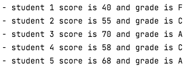

# Assign Grades
## Moeilijkheid:   

Write a program that reads student scores, gets the best score and assigns grades based on the following scheme:

- Grade is A if score >= best-5 
- Grade is B if score >= best-10 
- Grade is C if score >= best-15 
- Grade is D if score >= best-20
- Grade is E if score >= best-20
- Grade is F if score < best-20

So for example if we have 4 scores:
- student 0 score is 40 and grade is F (40 < bestscore-20)
- student 1 score is 55 and grade is C (55>=bestscore-15 but 55 < bestscore-10)
- student 2 score is **70** and grade is A **(best score)**
- student 3 score is 58 and grade is C (58>=bestscore-15 but 58 < bestscore-10)
- student 4 score is 68 and grade is A (68>=bestscore-5)

 
 

## Expected outcome

