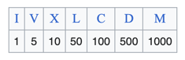
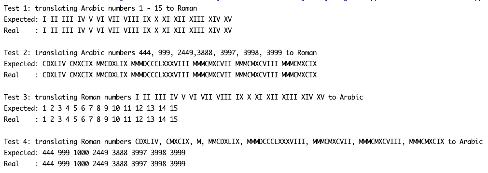

# Roman numbers
## Difficulty:    

Craft an algorithm, possibly beginning with pseudocode, to handle the conversion of Arabic numbers to Roman numerals.
Develop another algorithm and implementation for the reverse translation (Roman to Arabic).
Proceed by implementing these translations within the `arabicToRoman` and `romanToArabic` method bodies within the `RomanMain` class.

## Roman numbers rules:

* A symbol placed **after** another of equal or greater value **adds** its value.
  * no more than 3 of the same symbols in a row
* A symbol placed **before** one of greater value **subtracts** its value.
  * Allowed “subtractive” notations: IV, IX, XL, XC, CD, CM
* maximum number represented: 3999 (MMMCMXCIX)

### Implement the following 2 methods

* `String arabicToRoman(int arabic)` : 
  converts our number system to Roman numerals, following the conversion rules.  E.g.: 
  `arabicToRoman(2) -> "II"` 
  `arabicToRoman(213) -> "CCXIII"`  
* `int romanToArabic(String roman)` :  
  converts our number system to Roman numerals, following the conversion rules.  E.g.: 
  `romanToArabic("CDX") -> 410` 
  `romanToArabic("MDCCXLI") -> 1741` 

### Sample output
Running the program in `RomanMain` should yield the following result:

Add some test cases that you think are a good addition to the ones present.

 
 
