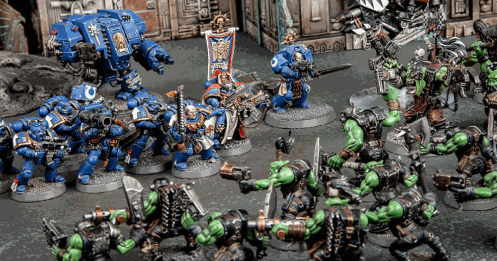

# Battle Calculator
## Difficulty:   

## Tabletop  games
In a famous table top game, players use small minifigures to simulate fantasy battles between different races in the galaxy.

In this tabletop game, battles are resolved using dice rolls.
When a player's unit aims to attack another, they roll a dice to determine the success of the attack.
The likelihood of success is influenced by the attacking unit's strength and the defending unit's toughness. Refer to the provided sheet for details.

When a unit of strength 4 attacks a unit with toughness 5, the attacker must roll a 5 or higher on a single die to wound the defender. This results in a 66.67% chance of success, as only a roll of 5 or 6 is effective.

Note: 'N' denotes an impossibility to wound the defender, indicating a 0% chance of success.

### Part1: implement the 'calculateSuccessChange' method
`double calculateSuccessChange(int strength, int toughness)`: 
This method computes the probability of an attack succeeding, represented as a percentage,
based on the provided strength and toughness values.  Examples: 
`calculateSuccessChange(4,5) == 33.33333333` 
`calculateSuccessChange(2,6) == 0`

### Expected outcome

 

## Part 2: Roll for success!
Currently the application is not really usefull, you still need to roll a dice to see if a attack is succesfull or not.

Implement a roll for the attack, if for example a attack has 50% to be successfull do a random roll that has 50% chance to say the attack is succesfull and 50% chance to say the attack was unsuccesfull

### Example result
The result should look something like this:

