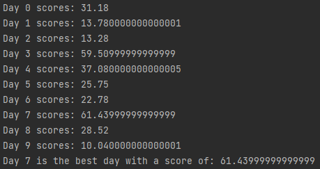

# Weather forecast
## Difficulty:   

##Planning a BBQ Based on Weather Forecast

1. **Vacation and BBQ Planning**
- We're organizing a 10-day vacation and arranging a BBQ for friends during this time.
- The goal is to analyze the weather forecast to identify the most suitable day based on sun percentage and temperature for hosting the BBQ.

2. **Data Analysis Process** (_step 1_)
- The weather forecast data for the 10 days is stored in a text file and needs to be read. The structure is as follows:<br>

| hour | temperature | sunPercentage |
    | ----- | ----------| ------------ |
| 0 | 7 | 0 |
| 1 | 7 | 6 |
| 2 | 8| 13 |
|...|...|...|
|23|7|6|
|0|14|0|
|1|15|1|
|...|...|...|

3. **Determining the Optimal Day** (_step 2_)
- To select the best day for the BBQ, we'll calculate a score for each hour between 14:00 and 22:00 (8 hours in total) for every day.
- The score per hour is computed by multiplying the sun's percentage with the temperature. For instance:
    - On Day 1 at 15:00, if the sun percentage is 59% and the temperature is 12°C, the score is 12 * 59 = 7.08.
    - Calculate similar scores for subsequent hours (16:00, 17:00, etc.) and sum these scores to determine the overall score for each day.
- The day with the highest cumulative score will be identified and displayed as the optimal day for hosting the BBQ.

## Implement the following methods

### step 1:  implement `readData`
`void readData(ArrayList<String> lines)`:<br>
Fills the `weatherForecast` array with data read from the `weatherForecast.txt`.

#### hint:
Don't forget you can use the `Integer.parseInt(string)` method to convert a string number to int.
```Java
int x = Integer.parseInt("5");
```

### step 2: implement `printBestDay`
`void printBestDay()`:<br>
calculates and prints the best day to host the barbeque.

#### hint:
Don't forget you can convert `int` to `double` by 'casting':
```Java
double y = (double) 5; // 5.0
```

## expected output

