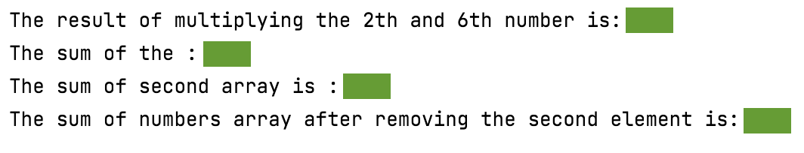

# Practice with Arrays (again!)
## Difficulty:   

Getting some practice with arrays
1) print the result of multiplying the 2nd and 6th number from the numbers array
2) Loop over the numbers array and show the result of the sum
3) Initialize a new array that stores the same numbers as the numbers array, but each even number is divided by 2 and each odd number is multiplied by 3. Then print the sum of all numbers from the new array
4) _Extra challenge: Implement the 'removeElementFromArray' method._

##Expected outcome

## Relevante links
* [Java documentatie van de SaxionApp](https://saxionapp.hboictlab.nl/nl/saxion/app/SaxionApp.html)

