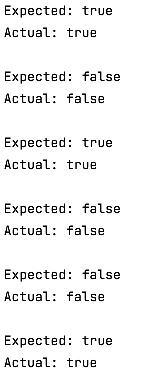

# Array comparing
## Moeilijkheid:   

Write a program that can tests 2 arrays for equality, by implementing the compareArrays(int[] array1, int[] array2) method. 2 arrays are equal if they contain exact the same numbers in the same order.

For example: 
If:`a = {1,5,6}`
`b = {1,5,6}`
`c = {5,6,1}` 
Then: 
`compareArrays(a,b) == true`

`compareArrays(b,c) == false`

`compareArrays(a,c) == false`

 
 

## Expected outcome:

 
 

## Extra challenge
create the compareArrays2(int[] array1, int[] array2) method, in this method the order of array1 and array2 dont matter. But all values in array1 should all be in array2 and all values in array2 should be in array1

For example: 
If:`a = {1,5,6}`
`b = {1,5,6}`
`c = {5,6,1}` 
Then: 
`compareArrays(a,b) == true`

`compareArrays(b,c) == true`

`compareArrays(a,c) == true`
