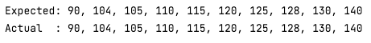

# Gym Row
## Moeilijkheid:   

In elementary school, children need to line up based on their height, with the shortest child at the front and the tallest at the back.

Write a  `sort()` function that can sort a array with the lengths of a bunch of children.

(online you can find many sorting algorithms but the challenge here is to think of one yourself)

 
 

tip:
- you are allowed to create a new array

**Expected outcome:**

