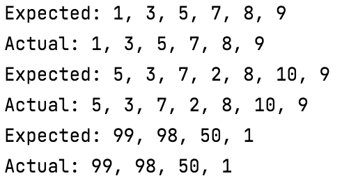

# Counting characters
## Moeilijkheid:   

Write a function eliminates duplicate numbers from an array and returns a new array.

Tips:
- You cannot decrease the size of an array. So if you want to delete something you need to create a new array that copies all the old elements minus the ones you want to remove.  
- For this exercise it is not a problem if your algorithm is somewhat inefficient

 
 

**Expected outcome:**

