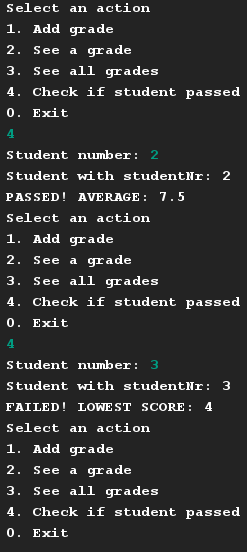

# Student Grading
## Difficulty:   

Write a program that can store grades per student, per test.

Each year a student has to do 4 tests, for each test he can get a grade (1-10).

for example:

| studentNr | test1 | test2 | test3 | test4|
|:-----:|:-----:|:-----:|:-----:|:-----:|
|0|6|6|6|7|
|1|5|6|5|6|
|2|8|8|7|7|
|3|9|4|9|5|
|4|6|6|10|5|

## Part 1: Complete the program
- implement a datamodel (2D array) that can store this data
- implement the following methods: `addGrade`, `getGrade` and `printAllGrades` 

`void addGrade(int studentNr, int testNr, int score)`:  
sets a grade for a given student and given test   
`int getGrade(int studentNr, int testNr)`: 
retrieves a grade for a given student and given test 

`void printAllGrades()`: 
prints every student and every grade the student obtained

## Part 2: PASS/FAIL check
Implement a 'Check Pass Status' feature in the menu allowing users to input a student number.
The program should then display either `PASSED! AVERAGE: X` or `FAILED! LOWEST SCORE: X` based on the student's performance.

**passed** 
A student passes if all test-scores are 6+, show the average of all his/her scores

**failed** 
A student failes if atleast 1 test is <6, show the lowest score in all his/her tests

### Expected Outcome:

