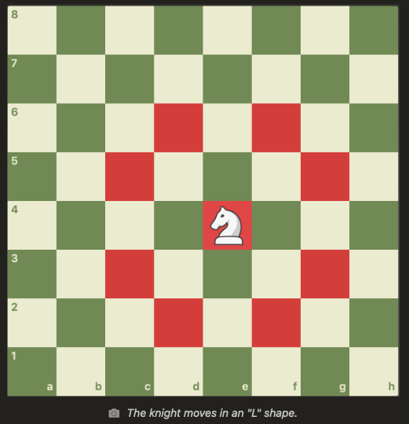
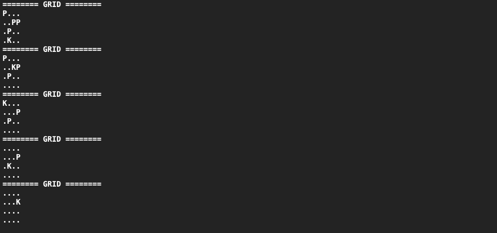

# Grid Movement
## Difficulty:   

The task is for the knight to capture all the pawns. Develop an algorithm to enable the knight to eliminate all pawns within four moves. It's important to note that, in this game, the pawns remain stationary. The knight follows a specific movement pattern, always making an L-shaped move, either advancing 1 tile vertically and 2 tiles horizontally, or moving 2 tiles vertically and 1 tile horizontally.

#### example for movement of the knight

## Exercise
- Implement the `nextMove()` method. This method should move the knight to the next tile.
  - The knight must attack a single pawn every turn,  the grid is made so that each turn there is only a single pawn within reach.
  - The knight must follow the movement-behaviour described above
- Print the grid after each move using the given `printGrid()` method.

## notes
- To make it a bit simpler the grid is already given and is only 4 by 4 tiles. The knight cannot move out of the grid.
- Some helper methods are given:
  - `doesContainPawn(int x, int y)` to check if a certain tile contains a pawn
  - `isInGird(int x, int y)` to check if position x,y is in the grid
  - `moveKnight(int x, int y)` to move the knight to position x,y
  - `printGrid()` to print the grid
- You only have to implement the `nextMove()` method.

## Expected output

- the knight moves from position grid[3][1] to the pawn in grid[1][2]
- the knight moves from position grid[1][2] to the pawn in grid[0][0]
- etc

