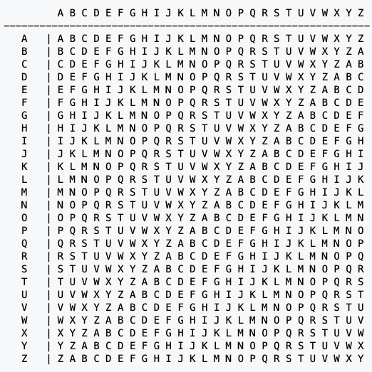
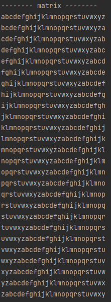
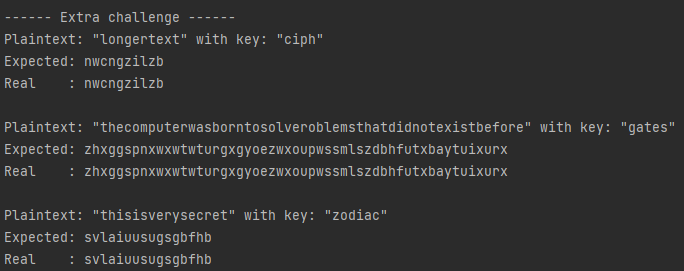

# Vigenere cipher
## Difficulty:   

## Vigenere cipher
The Vigenere cipher, an extension of the Ceasar Cipher, is an encryption method predating computers. It involves using a cipher word to encode a message through a matrix. For instance, when encrypting a word like 'text' with a cipher 'ciph,' each letter pairs up: 't' with 'c,' 'e' with 'i,' and so forth, finding intersections on a table. This process produces an encrypted message, such as 'vmma.'



#### Encrypting using the vigenere table:
1. Align the keyword (in this case 'ciph') with the plaintext (in this case 'text')<br>
   (Extra: in case the plaintext is longer than the key, the key gets repeated to match the plaintext length.)
2. To encrypt each character of the plaintext, locate the corresponding intersection point on the table. Align the plaintext character horizontally and the key vertically.
3. Perform step 2 for every character in the plaintext to generate the encrypted message.


The resulting encrypted message for the plaintext `text` with the cipher key `ciph` would be:

|  | char1 | char2 | char3 | char4|
|:-----:|:-----:|:-----:|:-----:|:-----:|
|plaintext|t|e|x|t|
|cipher key|c|i|p|h|
|encrypted text|v|m|m|a|


### Part 1: implement the vigenere cipher
- step 1: Implement the `generateMatrix()`<br>
  `char[][] generateMatrix()`:<br>
  Creates and returns the Vigenere cipher matrix<br>


- Step 2: Implement `encrypt(String word, String cipher)`<br>
  `String encrypt(String word, String cipher)`:<br>
  Encrypts a plaintext using the Vigenere cipher with a specified cipher key.

### tips
- instead of building the matrix by hand see if you can generate it
- use the printMatrix() function to see if your matrix is correct
- you can cast a character to a int, some examples:
```java
    char someChar = (char)97;   //result a
    char someChar = (char)98;   //result b
    char someChar = (char)99;   //result c
```
- pro-tip: use modulo to get the result after division
```java
    int result = 5%3;   //result 2 (divide 5 by as many times as possible by 3 and what remains is 2)
    int result = 50%15; //result 5 (divide 50 by as many times as possible by 15 (3x) and what remains is 5)
```

### Expected output



## Part 2: longer words
If our secret message contains more letters then our cipher we repeat our cipher, so for example if our secret message is 'longertext' and our cipher remains 'ciph' we going to repeat the cipher

|  | char1 | char2 | char3 | char4|char5|char6|char7|char8|char9|char10|
|:-----:|:-----:|:-----:|:-----:|:-----:|:-----:|:-----:|:-----:|:-----:|:-----:|:-----:|
|plaintext|l|o|n|g|e|r|t|e|x|t|
|cipher key|c|i|p|h|c|i|p|h|c|i
|encrypted text|n|w|c|n|g|z|i|l|z|b

### TODO: modify the encrypt method
Modify the method so it can handle plaintext longer than the cipher key.

### Expected output

