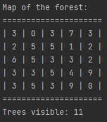

# Visible trees
## Difficulty:   

## Visible trees
_Once, there was a girl who adored writing complex algorithms, but her machine took an eternity to compute them. One day, while counting the trees visible from her window, she had an idea. She decided to consult the local forest ranger for a map of the forest situated to the east of her house._

She received the following map:

**3** | **0** | **3** | **7** | **3**
----|----|----|----|----
**2** | **5** | **5** | **1** | **2**
**6** | **5** | **3** | **3** | **2**
**3** | **3** | **5** | **4** | **9**
**3** | **5** | **3** | **9** | **0**

(she views this patch of forest from the left.)

- Each tree is depicted by a single digit indicating its height, ranging from 0 (shortest) to 9 (tallest).
- A tree is **visible** if every tree to its left is shorter than itself. The trees along the left edge are always visible since there are no trees to their left.

#### Visibility chart:
The following map is a cheatsheet containing the visible trees (with 'x' meaning a tree that isn't visible): 
(_Note: this is to help you understand the rules, you're not allowed to use this in your code - unless you derive it yourself_)

**3** | x | x | **7** | x
----|----|----|----|----
**2** | **5** | x | x | x
**6** | x | x | x | x
**3** | x | **5** | x | **9**
**3** | **5** | x | **9** | x

Some explaination, for the toprow:
- The top-left 3 is visible because it is on the left edge of the grid.
- The following 0 is **not** visible because the tree with height 3 on its left, is blocking the view
- The 3 following after is **not** visible because the tree with height 3 on its left, is blocking the view
- The 7 is visible because no trees on its left are the same height or larger

- If you use do this for all the trees, there should be **11** trees visible.

### Implement the following methods
1. `void readData(String filepath, int height, int width)`: 
   initializes a forest grid of given dimensions and fills it with data read from the file

2. `void printNumberOfTreesVisibleFromOutside()`: 
   Calculates how many trees are visible from the left side

Run the `runBasicTest` method to test

### tips
- first implement `readData()` and then `printNumberOfTreesVisibleFromOutside()`
- use the `Character.getNumericValue(char)` to convert a read character to a int
- numbers are always between 0-9 so you dont have to worry about double digits

### Expected outcome
`runBasicTest()` 

## EXTRA: A bigger forest
See if you algorithm also works for a bigger map, by running the `runExtraTest` method

### Expected outcome

`runExtraTest()` 

`Trees visible: 568`
