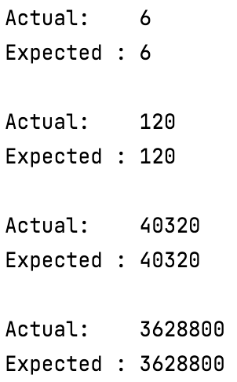

# Factorial basic
## Difficulty:   

Factorial represents the mathematical product of all positive integers from 1 up to a specific number n
n.
###TODO: implement the 'factorial' method
`int factorial(int input)`: 
calculates the product of all the integers equal or lower then the given number. Mathematical notation: n! 
For example: 
`factorial(3) = 3! = 3 x 2 x 1 = 6`
`factorial(4) = 4! = 4 x 3 x 2 x 1 = 24`

### Some examples
| n    | n! |
| -------- | ------- |
| 0  | 1    |
| 1 | 1     |
| 2    | 2    |
| 3    | 6    |
| 4    | 24    |
| 5    | 120    |

### Expected result

