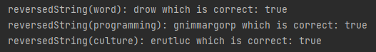

# Recursive reverse a string
## Difficulty:   

###Todo: implement the 'reversedString' method
`String reversedString(String word)`: 
Reverses the word it receives by using recursion
For example: 
`reversedString("happy") = "yppah";`

### Tips
1. Consider how you can reduce the problem's size and identify the base case. 
   a. **Base case**: Is it possible to reverse a single character? 
   b. **Recursive case**: What problem is smaller than reversing a string with five characters?
2. Useful methods:
- Utilize `"myString".charAt(x)` to retrieve the x-th character from a string. (result: 'i' if x=5)
- Employ `"myString".length()` to determine the length of a string (result: 8)
- Apply `"myString".substring(a, b)` to obtain a section of a string (result: "yStri" if a=1 and b=6)

### expected output

