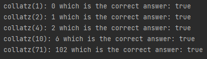

# Steps to solve
## Difficulty:   

###Collatz conjecture
The 'Collatz conjecture' algorithm proposes that when you repeatedly apply a specific set of operations to any positive integer, it will eventually result into 1:

- step 1: start with any positive integer
- repeat: If the number is even, divide it by 2.
- repeat: If the number is odd, multiply it by 3 and add 1. 

- eventually: The unproven theory:  _No matter which positive integer you start with, following these operations will eventually lead to the number 1._

####TODO: Implement the `collatz` method
`int collatz(int input)`: 
returns the number of steps before the input returns to 1, following the collatz conjecture 
For example: 
`collatz(10) = 6`  
because:
- 10 is even so divide by 2 (calculation 1)
- 5 is odd so multiply by 3 and then add 1 (calculation 2)
- 16 is even so divide by 2 (calculation 3)
- 8 is even so divide by 2 (calculation 4)
- 4 is even so divide by 2 (calculation 5)
- 2 is even so divide by 2 (calculation 6)  
   1 is the base case, we are done 
   To solve 10 to 1 we need 6 calculation steps, so the answer is 6

### Tips
- What does the method 'actually' return?
- how can you 'convert' the collatz calculation into the result that you return?

### expected output

