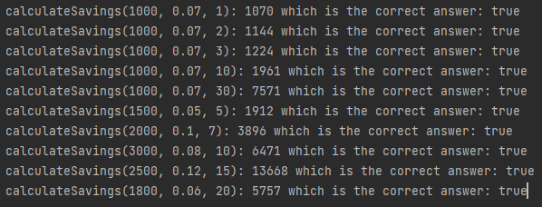
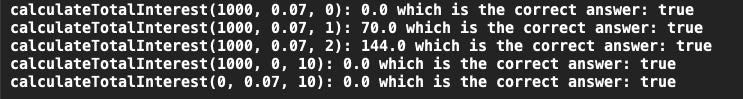

# Interest
## Difficulty:   

Some people say the 8th world wonder is compound interest. When you invest your money and get some amount of interest every month, you can make a lot of money by doing nothing!

But the calculation is often challenging.

Let's say you invest 1000 euros and get a 7% interest rate. How much money do you have after 30 years?

| year    | Savings |
| -------- | ------- |
| 0     | 1000    |
| 1     | 1070     |
| 2    | 1144    |
| 3    | 1224    |

**Note**: Each year, we round down the decimals for simplicity. For instance, in the second year, we technically have 1144.9, but we truncate it to 1149 to carry on with our calculations.

###TODO: implement the `calculateSavings` method
`int calculateSavings(int currentDeposit, double interestratefactor, int yearsLeft)`: 
calculates the savings recursively, given a deposit and a interestratefactor.

Run the `interestTest` by uncommenting to see if your implementation is correct.

### Tips
- use the tests to see if your algorithm works correctly.
- 7% interest rate on top of 100% converts to what double used in multiplication?

### expected output

###Extra challenge: implement the `calculateTotalInterest`
`double calculateTotalInterest(int currentDeposit, double interestRate, int yearsLeft)`: 
calculates the total earned interest on top of the original deposit

###hint:
- are the variables `currentDeposit, interestRate, yearsLeft` enough to keep track of everything you need for the recursion? 

### expected output Extra challenge

