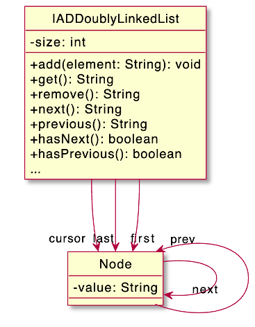

# Doubly Linked List with cursor
## Difficulty:   



An implementation of a Doubly Linked List is given. A nicer version includes a cursor that points at a "current" element. 

### TODO Finish the cursor implementation
**Implement the following methods**

`public void add()` (without parameters) will add a new node after the cursor node. After adding a node, the cursor will point to that new node. _the existing add methods have already been modified to ensure this behaviour_

`public String get()` (without parameters) will return the value of the cursor node

`public void remove()` (without parameters) will remove the cursor node. After removing a node, the cursor will point to the node previous to the removed node (or, if the first node was removed, it points to the new first node) _the existing remove methods have already been modified to ensure this behaviour_

`public String next()` will move the cursor to it's next node and returns that node's value

`public String previous()` will move the cursor to it's next node and returns that node's value

`public boolean hasNext()` returns true if the cursor does not point to the last node

`public boolean hasPrevious()` returns true if the cursor does not point to the first node

Implement these methods. Use the test program to verify your solution and write your own tests

#### expected output
The results of your implementation should match the expected output:

```
Test: Adding some values
Expected: [A, B, C, D]
Actual  : [A, B, C, D]
Has Next?
Expected: false
Actual  : false
...
```
etc. etc.
<br/>
<br/>


