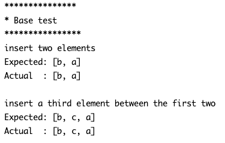

# Implementing our own ArrayList class
## Difficulty:   

We'll create our custom ArrayList implementation. This involves initiating an array and crafting our versions of fundamental ArrayList methods to deliver its functionality.

### TODO: 
finish the implementation for the `MyArrayList` class by implementing the following methods
1. `boolean isEmpty()`:  
   Checks if the list is empty and returns true if it is. 
    
2. `String get(int index)`: 
   Retrieve the element at specified index 
    
3. `String remove(int index)`: 
   Remove the element at specified index 
    

4. `boolean insert(int index, String newString)`: 
   Inserts a element at specified index and returns true if successful 
    

5. `int size()`: 
   Retrieves the number of (actual) elements in the list 
    

You can test your implementation by running the 2 test methods (in the `MyArrayListMain` class) and check whether the Expected and Actual output are the same. For example: 

### Hints
1. First, implement the methods without worrying about the length of the array that stores the Strings.
   1. Consider that elements might need to shift when calling the `remove` method.
2. If all base tests pass: The `insert` method has to provide the dynamic growing, taking into account the situation where a element is being added to a currently full list. So make sure the ArrayList 'grows' at the right time

 
 

