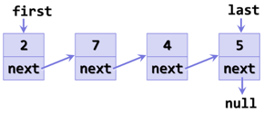

# Remove element from list
## Difficulty:    -   

Our `IADLinkedList` class contains functionality to add elements. We want to be able to remove elements as well. The class `IADLinkedListRemoveMain` class contains a test program that you can use to test your implementation.

## TODO
Given the class `IADLinkedList`. Implement the methods `removeFirst`, `removeLast` and (if you're fast) `remove`. Take the following steps:

1. Draw an object diagram of a linked list, for example:

 

2. Draw the steps that must be followed if you want to remove the first element.
    1. Which edge cases are important? (e.g. the list contains only one element)
3. Implement the method `removeFirst()`
4. Draw the steps that must be followed if you want to remove the last element.
    1. Which edge cases are important? (e.g. the list contains only one element)
5. Implement the method `removeLast()`
6. For fast students: 
   1. Draw the steps that must be followed if you want to remove the element at a certain index. If the index is out of bounds, nothing will be removed
   2. implement the method `remove(int index)` that removes the element at the given index.

 
 

