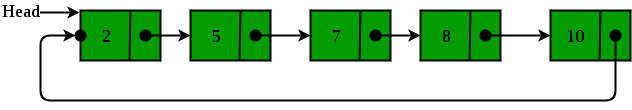
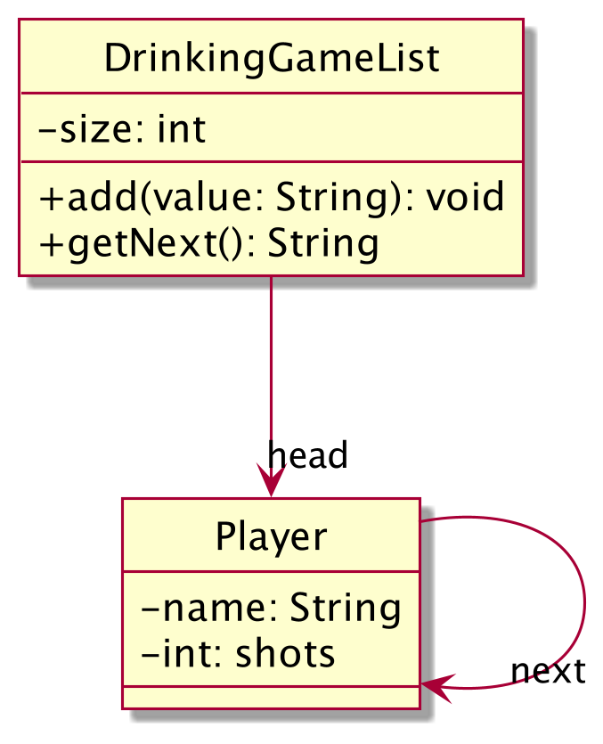

# Drinking Game
## Difficulty:   

### Drinking Game (Circular List)

In this simple drinking game, each player takes turns in throwing two four-sided (d4) dice. If the numbers on both dice are the
same, the player has lost and has to drink one shot.

Players reaching 3 shots are deemed too drunk to continue and are eliminated from the game. The game persists until only one player remains, who is then declared the winner.

### TODO

Implement the game. To simulate this game, use a circular linked list structure. In a circular list, the "last" Node / Player links back to the first Node / Player. Refer to the diagrams below for a visual representation.

For this particular case, we rename the `Node` class to `Player`. A Player has a name and an amount of consumed shots.

### Hints
The following order is suggested:

1. Implement the `Player` class first. This class should be a modified version of the `Node` class in previous exercises<br>
   Think about the utility methods your class needs (e.g. `get` and `set` for shots and name)
2. Implement the `DrinkingGameList` class next. This class is based on the `IADLinkedList` class from the previous exercises.<br>
   Think about what utility methods the (Circular version of a) Linked list would normally have (and which of those you actually will use): You can check the course material, the diagrams below or the previous exercise
3. Implement the gamelogic in `TurnMain`'s `run` method last, now that you know how your list will work.<br>
   How would the game keep track of which players are still "in" the game?

### Expected Output

The game output should be similar to this:

**_output start:_**
```
John throws 2 - 4
Pete throws 1 - 4
Kylie throws 2 - 1
John throws 3 - 3
John has to drink a shot!
John has drunk 1 shots
Pete throws 2 - 4
...
```

**_output end (John has already been eliminated in this example):_**

```
...
Kylie throws 4 - 3
Pete throws 1 - 2
Kylie throws 3 - 3
Kylie has to drink a shot!
Kylie has drunk 4 shots
Kylie is too drunk to continue
Pete has won!
```


### Helpful diagrams

#### Object diagram



#### Class diagram


<br/>
<br/>


