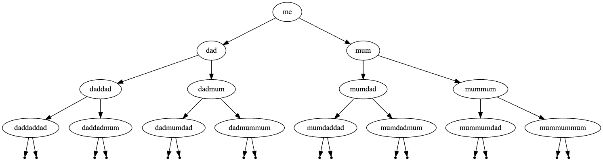

# Family Tree
## Difficulty:   

In this exercise, we create a representation of your family tree containing yourself and your predecessors.

Write a program that constructs your own family tree. The tree should contain three or four generations (how well do you know your predecessors?).

### TODO 1 - Construct family tree
Implement the `run()` method in the `FamilyTree` class.

#### Hints
  * Use the `IADTree` and `IADNode` classes as a basis for your family tree.
  * Use the method `IADTree.toDot()` to print a representation in the dot language. Copy this output and paste it in an online viewer (https://dreampuf.github.io/GraphvizOnline or https://edotor.net/) to create a graphical representation and verify whether the constructed tree is correct.

Example:

### TODO 2 - Counting elements
How many elements (nodes) are in your family tree? Write a method that counts the amount of nodes.

#### Hints:
* Add a method `IADTree.size()` that returns the number of nodes in the tree. Test this method on trees with different amounts of nodes.

 
 

