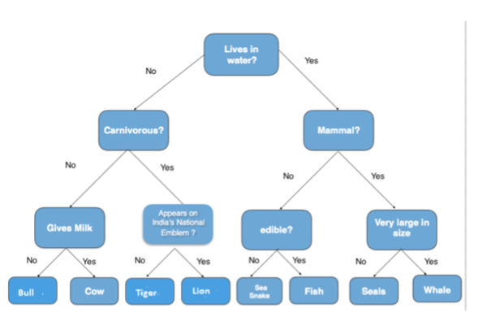

# Decision Tree
## Difficulty:   

Write a program that leverages a constructed decision tree. You may use one of the examples below, but feel free to create your own decision tree.

#### Hints
* Use the provided `IADNode` and `IADTree` classes - modify them if necessary
* First, create a decision tree, where the nodes contain yes / no questions. Leafs (nodes without left and right) contain the conclusions of the paths.
* Write a program that asks the user the provided yes / no questions and that will show the decision based on the answers.

Example program output (see first example tree below):

#### Example trees:

 
 

