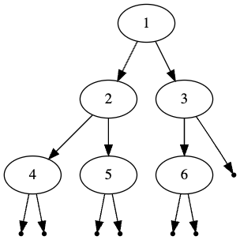
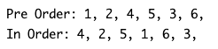

# Tree Order Representation
## Difficulty:   

There are several ways to represent the contents of a binary tree. We already provided you with the code to create a dot representation of the tree. Common ways of representing the contents of a tree are the _post-order_, _in-order_ and _pre-order_ representations. They entail the following:

* In the _pre-order_ representation, first the value of the root is shown, then the _pre-order_ of its left tree and then the _pre-order_ of its right tree.
* In the _in-order_ representation, first the _in-order_ of the left tree is shown, then the root value and then the _in-order_ of the right tree.

As an example: given the following tree:

The result of the _pre-order_ and _in-order_ representation should be as follows:

### TODO
Implement the methods `preOrder()` and `postOrder()` in the `IADTree` class. 

#### Hints
* The class `TreeOrderMain` contains a test program for the example tree. Feel free to add some extra nodes.
* Don't try to put all logic in the `IADTree` class only. You can get some inspiration from the implementation of the `toDot()` method.

 
 

