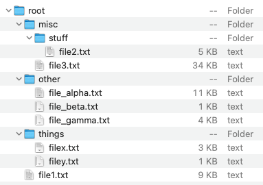

# Folder Structure
## Difficulty:   


A folder can be seen as a special type of tree. In this case, we have a tree with (possibly) more than two subtrees. For example:



In this case, we have a root folder named 'root' with three subfolders 'misc', 'other' and 'things'. Some folders contain files with a certain size.

### TODO 1
Write a program that is able to store the contents of a folder structure and that can calculate the total size of a folder and its subfolders and show the folder structure in a String representation:

#### Hints
* The `FolderMain` class contains some commented-out code that creates the given folder structure.
* In this exercise, we do not use an encompassing `IADTree`-like class
* Modify the `IADNode` class from the previous exercises. 
* The `IADNode` class can now represent both folders and files.
  * A folder is an `IADNode` with subfolders. It may contain multiple files and subfolders.
  * A file is a 'Leaf' - an `IADNode` without subfolders
* The `IADNode` must not only contain a name but also a size
  * For files, the size represents the size of the file in KB. This value can be requested by a call to the method `size()`
  * For folders, the size must not be stored, but must be calculated using the method `size()`; this method returns the sum of the sizes of the files in the folder and in its subfolders. 

### TODO 2
Add a `toString()` to the the `IADNode` class. This method returns the folder structure in a single-line String (see example)

#### example output

```
Total folder size: 72
root-> [misc-> [stuff-> [file2.txt 5 KB, ], file3.txt 34 KB, ], other-> [file_alpha.txt 11 KB, file_beta.txt 1 KB, file_gamma.txt 4 KB, ], things-> [filex.txt 7 KB, filey.txt 1 KB, ], file1.txt 9 KB, ]
```

_same output, but with a few linebreaks manually added for better overview:_
```
Total folder size: 72
root-> [misc-> [stuff-> [file2.txt 5 KB, ], file3.txt 34 KB, ], 
   other-> [file_alpha.txt 11 KB, file_beta.txt 1 KB, file_gamma.txt 4 KB, ], 
   things-> [filex.txt 7 KB, filey.txt 1 KB, ], file1.txt 9 KB, ]
```

<br/>
<br/>


