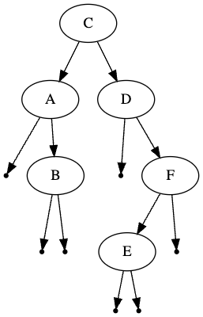

# Sorted Tree
## Difficulty:   

So far, we have constructed trees by manually adding subtrees to nodes. This can be rather tedious. We would like to just add elements to a tree and have the tree decide where the new element must be placed.

One method of deciding the location of new nodes is by using the alphabetical order. Items that come before the value of the current node must be added to the left side of the node; items that come after the value of the current node must be added to the right side of the node.

### TODO 1
* Implement the `add()` method of the `IADTree` class. Verify your implementation by adding some values and copy-paste the `toDot()` String in a graphviz viewer (e.g. https://dreampuf.github.io/GraphvizOnline)
  * _Hint_ use the `public int compareTo(String other)` of the `String` class to compare to Strings.

#### example
After adding nodes in the order C - A - B - D - F - E the tree should look like this:



### TODO 2
Add Strings in backwards alphabetical order. What is the effect on the tree structure? 

### TODO 3
* One way to verify the correct implementation is by viewing an _in-order_ representation of the tree. Copy your solution from the previous exercise and verify that your sorted tree works as expected. For example:

```
  IADTree tree =new IADTree();
  tree.add("C");
  tree.add("A");
  tree.add("B");
  tree.add("D");
  tree.add("F");
  tree.add("E");
  System.out.println(tree.inOrder());
```
should yield: `A, B, C, D, E, F, `


<br/>
<br/>


