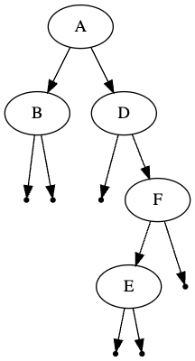
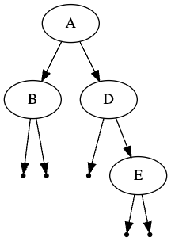

# Removing nodes from a Tree
## Difficulty:   

Generally, trees can be extended by adding elements, but should also be able to remove elements. In our main class `TreeRemovalMain`, we create the following tree:

### Exercise
* Implement the `remove(String value)` method of the `IADTree` class. Although the given tree is nicely ordered, for the first exercise you just have to remove the given element without worrying about ordering

#### Hints 
* identify the different cases first (e.g. is the element a leaf etc.)
* If the `value` is not present in the tree, nothing happens
* You may assume that the `value` is at most present in one node

#### example output
After removing 'C' from the example tree, your new tree might look like this (other solutions are possible):

If we now remove 'F' from the tree, the new tree looks like this:

### Extra challenge
* Ensure that the tree remains ordered after removing the element

 
 

